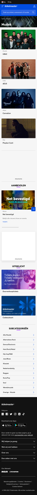

# Procesverslag
Markdown is een simpele manier om HTML te schrijven.  
Markdown cheat cheet: [Hulp bij het schrijven van Markdown](https://github.com/adam-p/markdown-here/wiki/Markdown-Cheatsheet).

Nb. De standaardstructuur en de spartaanse opmaak van de README.md zijn helemaal prima. Het gaat om de inhoud van je procesverslag. Besteedt de tijd voor pracht en praal aan je website.

Nb. Door *open* toe te voegen aan een *details* element kun je deze standaard open zetten. Fijn om dat steeds voor de relevante stuk(ken) te doen.

## Jij

  
uitwerken voor kick-off werkgroep

  ### Auteur:
  Leanne Man

  #### Je startniveau:
  Blauw &#128153;

  #### Je focus:
  Surface plane
 

## Je website

  
uitwerken voor kick-off werkgroep

  ### Je opdracht:
  Ticketmaster 
  https://www.ticketmaster.nl/

  #### Screenshot(s) van de eerste pagina (small screen): 
  <h1>homepagina</h1>
  

  #### Screenshot(s) van de tweede pagina (small screen):
  <h1>muziekpagina</h1>
  
 

## Toegankelijkheidstest 1/2 (week 1)

  
uitwerken na test in 2e werkgroep

  ### Bevindingen
  Lijst met bevindingen die in de test naar voren kwamen:
  <ul>
    <li>Alle headings op de homepagina worden gevonden door de screenreader</li>
    <li>Alle links op de homepagina worden ook gevonden door de screenreader</li>
    <li>Ze zeggen bij de links bij het kopje 'Recent bekeken' "Bezochte link" in plaats van "Link". De screenreader weet dus ook al goed dat de gebruiker deze link heeft bezocht en laat dit weten</li>
    <li>Alle links in de navigatiebalk header worden gevonden. De afbeelding naast het Paypal icoon</li>
  </ul>

## Breakdownschets (week 1)

  
uitwerken na afloop 3e werkgroep

  ### de hele pagina: 
  

  ### dynamisch deel (bijv menu): 
  

  ### wellicht nog een dynamisch deel (bijv filter): 
  Niet van toepassing

## Voortgang 1 (week 2)

  
uitwerken voor 1e voortgang

  ### Stand van zaken
  hier dit ging goed & dit was lastig (neem ook screenshots op van delen van je website en code)

  GOED:
      
    <b>- Het opstellen van de html toen ik eenmaal begonnen was</b>
     
    
      
     <b>- Het maken van de breakdownschetsen</b>
      
    
      
      <b>- De oefenopdrachtjes in de les (Vooral die van flexbox!!)</b>

  LASTIG:
     
      <b>- Uitvinden hoe ik precies alles op Github moet plaatsen en hoe dit up 2 date gaat</b>
       
      <b>- Het opstarten van de html. Ik had dit al een tijdje niet gedaan dus ik liep even vast op het begin</b>

  ### Agenda voor meeting
  samen met je groepje opstellen

  <b>Leanne</b>
  <li> Hoe maak je de afbeelding van het logo ook een hidden H1 in de HTML? </li>
  <li> Moet er voor de ul een nav ? </li>
  <li> Bij H2 “Populair” waar doe je de img tag? </li>
  <li> Hoe schrijf ik een bepaald stukje in HTML van de footer? </li>

   

  <b>Chimène</b>
  <li> Hoe kan ik knoppen/afbeeldingen juist downloaden van de website? </li>
  <li> Hoe kan ik de lettertype van mijn website nu in mijn css krijgen? </li>
  <li> Maakt het uit of je png gebruikt of moet je svg gebruiken? </li>
  <li> Meerdere links stijlen tegelijk in css. Doe ik nu met classes, maar kan dit ook makkelijker? </li>

   

  <b>Martin</b>
  <li> Maakt het uit wat voor soort bestand een afbeelding is? (Ex. png svg jpg webp) </li>
  <li> Hoe hou ik dit icoontje altijd dezelfde plek in het scherm? </li>
  <li> Hoe zorg ik dat iets verdwijnt als iets scrollt? </li>
  <li> Welke waarden zijn het handigst om te gebruiken als je alles responsive wil houden? </li>

   

  <b>Kim</b>
  <li> Hoe maak je een pauze knop voor een carrousel? </li>
  <li> Hoe maak ik de gekleurde ronde onderkanten bij sections? </li>
  <li> Hoe loop je een animatie? </li>
  <li> Waarvoor mocht je nou precies wel een class voor gebruiken? </li>

   

  <b>Rosalie</b>
  <li> Hoe laat ik een uitklapmenu groeien? </li>
  <li> Hoe vergroot ik een image binnen een bepaalde box zonder dat die er buiten komt? </li>

  ### Verslag van meeting
  hier na afloop snel de uitkomsten van de meeting vastleggen

  - het hamburgermenu moet je buiten de nav plaatsen
  - bij sections mag een class
  - section.knoppen ul a { } , bij section.knoppen > a { } alleen directe kinderen
  - margin: 0; (niet auto;)
  - aria-current=”page” op de huidige pagina

## Voortgang 2 (week 3)

  
uitwerken voor 2e voortgang

  ### Stand van zaken
  hier dit ging goed & dit was lastig (neem ook screenshots op van delen van je website en code)

  GOED:
     
      <b>- Het opstellen van de html</b>
       
      

  LASTIG:
     
      <b>- Ik raakte in de war van de vele sections die ik had... dus even kleurtjes gegeven om het wat duidelijker te maken voor me wat bij welke section hoort</b>
       
      
     
      <b>- Als ik mijn nav open klap zie ik de a'tjes niet...</b>
       
       

  ### Agenda voor meeting
  samen met je groepje opstellen

  Ik heb Chimène's site bekeken en zij mijne. Ook heb ik haar Github gecontroleerd en is up to date. 
  Chimène haar website is goed toegankelijk, alle plaatjes zijn te zien en ze heeft al veel content in haar HTML staan.

  <b>Leanne</b>
  <li> Hoe connect ik mijn tweede CSS bestand juist aan de HTML? </li>
  <li> Mijn nav werkt niet :( </li>
  <li> Hoe doe ik ook alweer het juiste lettertype importeren? </li>
  <li> Hoe verwijder je iets op Github? </li>

   

  <b>Chimène</b>
  <li> Hoe krijg ik twee a’tjes naast elkaar als button? </li>
  <li> Bij een section werkt flex niet </li>
  <li> Hoe moet ik column toepassen op een bepaalde section? </li>
  <li> Menu knop snap ik niet hoe die werkt </li>

   

  <b>Martin</b>
  <li> Hoe krijg ik dit icoon helemaal links </li>
  <li> Hoe maak ik dit carousel </li>
  <li> Hoe is dit handig om te maken met grid </li>
  <li> Moeten alle buttons naar iets leiden? </li>

   

  <b>Kim</b>
  <li> Lettertype toepassen werkt niet bij de  H2 (?) </li>
  <li> Background-size: cover; geeft error aan? </li>
  <li> Hoe fix ik de nav button </li>

   

  <b>Rosalie</b>
  <li> Hoe krijg ik mijn tekst over een header </li>
  <li> Hoe laat ik mijn uitklap menu groeien </li>

  ### Verslag van meeting
  hier na afloop snel de uitkomsten van de meeting vastleggen

  - om de randjes vol te krijgen doe je margin: 0; op de body, niet op de header/section
  - de nav zag je niet omdat het dezelfde kleur had als de background
  - font-face en network + cache legen om de fonts op te halen

## Toegankelijkheidstest 2/2 (week 4)

  
uitwerken na test in 9e werkgroep

  ### Bevindingen
  Lijst met je bevindingen die in de test naar voren kwamen (geef ook aan wat er verbeterd is):

  - De screenreader pakt alle kopjes en links 
  - De screenreader leest ook goed de alt teksten voor; fijn, want bij de ticketmaster site zelf hebben de afbeeldingen geen alt!

  De WCAG checklist: 

  

## Voortgang 3 (week 4)

  
uitwerken voor 3e voortgang

  ### Stand van zaken
  hier dit ging goed & dit was lastig (neem ook screenshots op van delen van je website en code)

  GOED:
     
      <b>- Start aan de footer stylen</b>
       
      

  Meer procesdocumentatie hieronder, maar dit was na de 3e voortgangsgesprek

  

  ### Agenda voor meeting
  samen met je groepje opstellen

  <b>Leanne</b>
  <li> Het juiste lettertype werkt niet </li>
  <li> Hoe doe je de zoekbalk in de header een rij naar onder </li>
  <li> Hoe zet ik de H2 en A (Tickets) op de goede positie </li>
  <li> Hoe verander ik volgorde van afbeelding + plaatje bij "Uitgelicht". Met flex? </li>
  <li> Hoe voeg ik het paarse lijntje onder "recent bekeken" en "populair" toe? </li>
  <li> Hoe kan ik het beste het zwarte randje in de header maken? met p? <li>

    

  <b>Chimène</b>
  <li> meer uitleg over @media Queries </li>
  <li> wil een border om mijn element, maar ik krijg het niet voor elkaar </li>
  <li> Jusitify conent lijkt niet te werken </li>
  <li> Hoe krijg ik een afbeelding links en tekst rechts met flex? </li>

    

  <b>Martin</b>
  <li> Hoe zorg ik ervoor dat de nav bar blijft staan </li>
  <li> Mag ik hier classes gebruiken? </li>
  <li> Gebruik van pixels </li>

    

  <b>Kim</b>
  <li> Hoe fix ik de padding bij de icoontjes in de NAV? </li>
  <li> Hoe voeg ik een to top button toe </li>
  <li> Hoe zat het ook en weer met de 2e pagina en de stylesheets? </li>
  <li> -webkit-background-clip: text; geeft een error, is dat OK? </li>
  <li> Waar kan ik het beste terecht als ik hierna tegen problemen oploop met Javascript? </li>

   

  <b>Rosalie</b>
  Die was niet aanwezig.

  ### Verslag van meeting
  hier na afloop snel de uitkomsten van de meeting vastleggen

  - de input moet in een formulier met label, button (visually hidden)
  - px vermijden
  - background-image: vw;
  - de zwarte achtergrond header in p in header en dan flex gebruiken

## Eindgesprek (week 5)

  
uitwerken voor eindgesprek

  ### Je uitkomst - karakteristiek screenshots:
  
  

  ### Dit ging goed/Heb ik geleerd: 
  Het opstarten van de FED opdracht vond ik erg lastig. Ik had al een jaar niet meer met html, css en javascript gewerkt, maar met behulp van de lessen (en een goed geheugen)is het weer goed gekomen. Ik heb weer de kennis van de basis html en css terug in mijn hoofd gekregen en ook nieuwe dingen toegepast zoals dark mode en states t.o.v. vorig jaar. Ook deed ik actief mee met de opdrachtjes in de les.

     
      <b>- Van scratch beginnen met een website bouwen </b>
       
      
     
      <b>- Dark mode toepassen </b>
       
       
     
      <b>- Focus state op de search bar </b>
       
      
     
      <b>- Hover state op link </b>
       
      
     
      <b>- Valideren van de html </b>
       
      

  ### Dit was lastig/Is niet gelukt:
  Ik vond bepaalde dingen stylen lastig. Ik heb ook wat dingen aan studentassistenten gevraagd maar bij 1/2 dingentjes geen antwoord op gekregen helaas...

   
        <b>- Deze section scrollbaar maken </b>
         
        

## Bronnenlijst

  
continu bijhouden terwijl je werkt

  Nb. Wees specifiek ('css-tricks' als bron is bijv. niet specifiek genoeg). 
  Nb. ChatGpT en andere AI horen er ook bij.
  Nb. Vermeld de bronnen ook in je code.

  1. Hoe de label en input gebruiken: css-tricks.com/html-inputs-and-labels-a-love-story/ (Amber Wilson, 2021)
  2. Details element: developer.mozilla.org/en-US/docs/Web/HTML/Element/details 
  3. Foto banner op muziekpagina: www.simkins.com/news/secondary-ticketing-safeguards-imposed-on-ticket-resellers-and-event-organisers 
  4. Alle foto's zijn van de Ticketmaster site zelf

